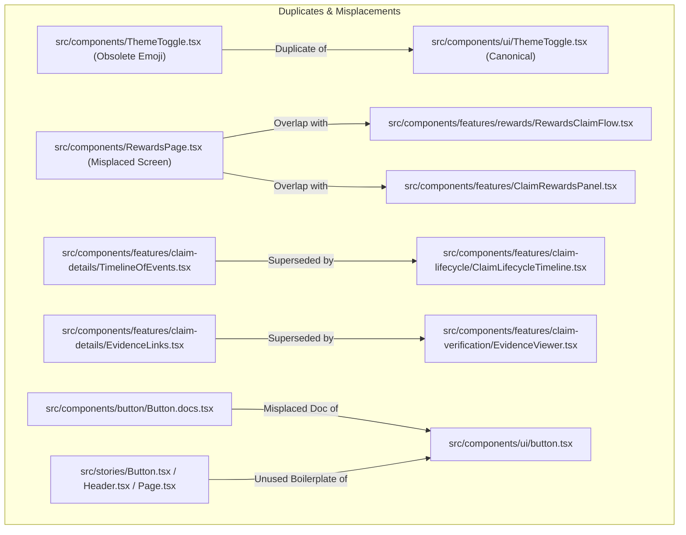

# Component States and Storybook Coverage Inventory

> **Document ID:** STAB-DOC-FE-003  
> **Linked Issue:** [#434](https://github.com/DigiNodes/truthbounty-frontend/issues/434)  
> **Status:** Implementation Baseline / Normative Inventory  
> **Authority:** Frontend / UX Maintainers  
> **Companion Documents:**
> - [UI State Model (`docs/UI_STATE_MODEL.md`)](file:///c:/Users/hp/OneDrive/Desktop/GrantFox/truthbounty-frontend/docs/UI_STATE_MODEL.md)
> - [V2 Design System (`docs/ux/DESIGN_SYSTEM.md`)](file:///c:/Users/hp/OneDrive/Desktop/GrantFox/truthbounty-frontend/docs/ux/DESIGN_SYSTEM.md)
> - [Transaction State Model (`docs/ux/TRANSACTION_STATE_MODEL.md`)](file:///c:/Users/hp/OneDrive/Desktop/GrantFox/truthbounty-frontend/docs/ux/TRANSACTION_STATE_MODEL.md)
> - [Information Architecture (`docs/ux/INFORMATION_ARCHITECTURE.md`)](file:///c:/Users/hp/OneDrive/Desktop/GrantFox/truthbounty-frontend/docs/ux/INFORMATION_ARCHITECTURE.md)
> - [Threat Model (`docs/THREAT_MODEL.md`)](file:///c:/Users/hp/OneDrive/Desktop/GrantFox/truthbounty-frontend/docs/THREAT_MODEL.md)

---

## 1. Executive Summary & Purpose

The purpose of this inventory is to establish a rigorous, exhaustive record of all shared and feature components across the TruthBounty V2 frontend. This document establishes:
1. **Repository Links & Consuming Screens:** Direct file paths for every component and the approved screens/routes consuming them.
2. **Canonical State Coverage:** Precise mapping of each component's support for the 9 canonical protocol and UX states (`loading`, `empty`, `error` / `failed`, `stale`, `permission denied` / `unauthorized`, `pending`, `confirmed`, `finalized`, and `reorged`).
3. **Storybook & Test Coverage Audit:** Explicit verification of existing Storybook stories and Jest unit/integration tests, highlighting reproducible gaps.
4. **Duplicate & Orphan Identification:** Cataloging duplicated and orphaned components without refactoring them in this issue, preserving strict contribution boundaries.
5. **Actionable Implementation Proposals:** Structured roadmap dividing necessary remediation into dedicated future issues.

---

## 2. Canonical State Terminology & Contract

Per [`docs/UI_STATE_MODEL.md`](file:///c:/Users/hp/OneDrive/Desktop/GrantFox/truthbounty-frontend/docs/UI_STATE_MODEL.md) and [`docs/ux/TRANSACTION_STATE_MODEL.md`](file:///c:/Users/hp/OneDrive/Desktop/GrantFox/truthbounty-frontend/docs/ux/TRANSACTION_STATE_MODEL.md), all user-facing components that present chain, API projection, or wallet state must render exact observed states. The frontend **never fabricates** transaction success, settlement, rewards, reputation, or protocol state.

| Canonical State | Definition | ARIA / Accessibility Contract | Primary Technical Triggers |
|---|---|---|---|
| **`loading`** | Fetch, pre-flight simulation, or transaction in flight | `role="status" aria-busy="true"` | React Query `isLoading` / `isFetching`, `validating` machine state |
| **`empty`** | Fetch succeeded with zero records | `role="status"`, neutral UI + actionable CTA | Succeeded query with empty result set (`data.length === 0`) |
| **`error` / `failed`** | RPC error, simulation revert, contract execution revert, or network failure | `role="alert" aria-live="assertive"`, retry affordance | Caught exception, receipt status `0`, hook error channel |
| **`stale`** | Data exists but age exceeds freshness bound | `role="status"`, warning banner + timestamp, manual refresh | `dataUpdatedAt` older than freshness SLA, offline or paused query |
| **`permission denied`** | Wallet disconnected, wrong chain, missing role, or rejected authorization | `role="status"`, fail-closed message | `IntegrityBoundary`, `WalletBoundaryGate`, `SiweFailureKind` |
| **`pending`** | Transaction submitted to mempool, hash known, awaiting block inclusion | `role="status" aria-busy="true"`, tx hash + explorer link | `useTransactionMachine` state `submitted` |
| **`confirmed`** | Included in block, receipt observed, block confirmations accumulating | `role="status"`, confirmation count (never claim finality prematurely) | `useReceiptProjection`, `useFinalizationDetection` |
| **`finalized`** | Finality threshold met per canonical chain parameters | `role="status"`, durable settled outcome | `useFinalizationDetection` state `finalized` |
| **`reorged`** | Previously confirmed block removed by chain reorganization | `role="alert"`, amber banner, auto-reconciliation | `useReorgReconciliation`, `useStateReconciliation` |

---

## 3. Approved Consuming Screens Mapping

Below is the mapping of all approved application screens to their entrypoints, routes, and consuming components.

| Screen Identifier | Route | Repository Entrypoint | Consumed Feature & Shared Components |
|---|---|---|---|
| **Dashboard** | `/` | [`src/app/(dashboard)/page.tsx`](file:///c:/Users/hp/OneDrive/Desktop/GrantFox/truthbounty-frontend/src/app/(dashboard)/page.tsx) | [`MainLayout`](file:///c:/Users/hp/OneDrive/Desktop/GrantFox/truthbounty-frontend/src/components/layout/MainLayout.tsx), [`StatsCards`](file:///c:/Users/hp/OneDrive/Desktop/GrantFox/truthbounty-frontend/src/components/features/StatsCards.tsx), [`ClaimRewardsPanel`](file:///c:/Users/hp/OneDrive/Desktop/GrantFox/truthbounty-frontend/src/components/features/ClaimRewardsPanel.tsx), [`ActivityAndNodes`](file:///c:/Users/hp/OneDrive/Desktop/GrantFox/truthbounty-frontend/src/components/features/ActivityAndNodes.tsx), [`VerificationNodes`](file:///c:/Users/hp/OneDrive/Desktop/GrantFox/truthbounty-frontend/src/components/features/VerificationNodes.tsx), [`ActiveClaimsTable`](file:///c:/Users/hp/OneDrive/Desktop/GrantFox/truthbounty-frontend/src/components/features/ActiveClaimsTable.tsx), [`DashboardSkeleton`](file:///c:/Users/hp/OneDrive/Desktop/GrantFox/truthbounty-frontend/src/components/skeletons/index.tsx) |
| **Claim Detail & Verification** | `/claims/[id]` | [`src/app/(dashboard)/claims/[id]/page.tsx`](file:///c:/Users/hp/OneDrive/Desktop/GrantFox/truthbounty-frontend/src/app/(dashboard)/claims/[id]/page.tsx) | [`ClaimDetails`](file:///c:/Users/hp/OneDrive/Desktop/GrantFox/truthbounty-frontend/src/components/features/claim-verification/ClaimDetails.tsx), [`EvidenceViewer`](file:///c:/Users/hp/OneDrive/Desktop/GrantFox/truthbounty-frontend/src/components/features/claim-verification/EvidenceViewer.tsx), [`StakeForm`](file:///c:/Users/hp/OneDrive/Desktop/GrantFox/truthbounty-frontend/src/components/features/claim-verification/StakeForm.tsx), [`VerificationActions`](file:///c:/Users/hp/OneDrive/Desktop/GrantFox/truthbounty-frontend/src/components/features/claim-verification/VerificationActions.tsx), [`FeatureErrorBoundary`](file:///c:/Users/hp/OneDrive/Desktop/GrantFox/truthbounty-frontend/src/components/common/FeatureErrorBoundary.tsx) |
| **Claim Submission** | `/claims/new` | [`src/app/(dashboard)/claims/new/page.tsx`](file:///c:/Users/hp/OneDrive/Desktop/GrantFox/truthbounty-frontend/src/app/(dashboard)/claims/new/page.tsx) | [`ClaimSubmissionForm`](file:///c:/Users/hp/OneDrive/Desktop/GrantFox/truthbounty-frontend/src/components/features/claim-submission/ClaimSubmissionForm.tsx), [`ClaimWorkflowReadinessGate`](file:///c:/Users/hp/OneDrive/Desktop/GrantFox/truthbounty-frontend/src/components/features/claim-submission/ClaimWorkflowReadinessGate.tsx), [`AllowanceDisplay`](file:///c:/Users/hp/OneDrive/Desktop/GrantFox/truthbounty-frontend/src/components/ui/AllowanceDisplay.tsx), [`ApprovalButton`](file:///c:/Users/hp/OneDrive/Desktop/GrantFox/truthbounty-frontend/src/components/ui/ApprovalButton.tsx) |
| **Protocol Treasury Admin** | `/treasury` | [`src/app/(dashboard)/treasury/page.tsx`](file:///c:/Users/hp/OneDrive/Desktop/GrantFox/truthbounty-frontend/src/app/(dashboard)/treasury/page.tsx) | [`MainLayout`](file:///c:/Users/hp/OneDrive/Desktop/GrantFox/truthbounty-frontend/src/components/layout/MainLayout.tsx), [`SafeTreasuryWithdrawalPanel`](file:///c:/Users/hp/OneDrive/Desktop/GrantFox/truthbounty-frontend/src/components/features/treasury/SafeTreasuryWithdrawalPanel.tsx) |
| **Stake & Treasury Withdrawal** | `/treasury/stake` | [`src/app/(dashboard)/treasury/stake/page.tsx`](file:///c:/Users/hp/OneDrive/Desktop/GrantFox/truthbounty-frontend/src/app/(dashboard)/treasury/stake/page.tsx) | [`MainLayout`](file:///c:/Users/hp/OneDrive/Desktop/GrantFox/truthbounty-frontend/src/components/layout/MainLayout.tsx), [`StakeTreasuryWithdrawalPanel`](file:///c:/Users/hp/OneDrive/Desktop/GrantFox/truthbounty-frontend/src/components/features/treasury/StakeTreasuryWithdrawalPanel.tsx) |
| **Identity & Humanity Verification** | `/identity` | [`src/app/(dashboard)/identity/page.tsx`](file:///c:/Users/hp/OneDrive/Desktop/GrantFox/truthbounty-frontend/src/app/(dashboard)/identity/page.tsx) | [`WorldcoinVerificationPanel`](file:///c:/Users/hp/OneDrive/Desktop/GrantFox/truthbounty-frontend/src/components/features/worldcoin/WorldcoinVerificationPanel.tsx), [`WorldcoinVerifyButton`](file:///c:/Users/hp/OneDrive/Desktop/GrantFox/truthbounty-frontend/src/components/features/worldcoin/WorldcoinVerifyButton.tsx), [`VerificationStatusIndicator`](file:///c:/Users/hp/OneDrive/Desktop/GrantFox/truthbounty-frontend/src/components/features/worldcoin/VerificationStatusIndicator.tsx), [`Button`](file:///c:/Users/hp/OneDrive/Desktop/GrantFox/truthbounty-frontend/src/components/ui/button.tsx) |
| **How It Works Guide** | `/how-it-works` | [`src/app/(dashboard)/how-it-works/page.tsx`](file:///c:/Users/hp/OneDrive/Desktop/GrantFox/truthbounty-frontend/src/app/(dashboard)/how-it-works/page.tsx) | Pure informational presentation, [`Button`](file:///c:/Users/hp/OneDrive/Desktop/GrantFox/truthbounty-frontend/src/components/ui/button.tsx) |
| **Verifier Dashboard** | `/verifier` | [`src/app/verifier/page.tsx`](file:///c:/Users/hp/OneDrive/Desktop/GrantFox/truthbounty-frontend/src/app/verifier/page.tsx) | [`VerifierDashboardContainer`](file:///c:/Users/hp/OneDrive/Desktop/GrantFox/truthbounty-frontend/src/features/verifier-dashboard/VerifierDashboardContainer.tsx), [`VerifierDashboard`](file:///c:/Users/hp/OneDrive/Desktop/GrantFox/truthbounty-frontend/src/features/verifier-dashboard/VerifierDashboard.tsx), [`EligibilityNotice`](file:///c:/Users/hp/OneDrive/Desktop/GrantFox/truthbounty-frontend/src/features/verifier-dashboard/EligibilityNotice.tsx), [`QueuePanel`](file:///c:/Users/hp/OneDrive/Desktop/GrantFox/truthbounty-frontend/src/features/verifier-dashboard/QueuePanel.tsx), [`PhasePanel`](file:///c:/Users/hp/OneDrive/Desktop/GrantFox/truthbounty-frontend/src/features/verifier-dashboard/PhaseAndSummaries.tsx), [`RewardsPanel`](file:///c:/Users/hp/OneDrive/Desktop/GrantFox/truthbounty-frontend/src/features/verifier-dashboard/PhaseAndSummaries.tsx), [`OutcomesPanel`](file:///c:/Users/hp/OneDrive/Desktop/GrantFox/truthbounty-frontend/src/features/verifier-dashboard/PhaseAndSummaries.tsx) |
| **Claim Detail Redirect** | `/claim-detail` | [`src/app/(dashboard)/claim-detail/page.tsx`](file:///c:/Users/hp/OneDrive/Desktop/GrantFox/truthbounty-frontend/src/app/(dashboard)/claim-detail/page.tsx) | [`MotionSafeStatus`](file:///c:/Users/hp/OneDrive/Desktop/GrantFox/truthbounty-frontend/src/components/ui/MotionSafeStatus.tsx) |
| **Global Frame** | All Routes | [`src/app/layout.tsx`](file:///c:/Users/hp/OneDrive/Desktop/GrantFox/truthbounty-frontend/src/app/layout.tsx) | [`Providers`](file:///c:/Users/hp/OneDrive/Desktop/GrantFox/truthbounty-frontend/src/app/providers.tsx), [`Sidebar`](file:///c:/Users/hp/OneDrive/Desktop/GrantFox/truthbounty-frontend/src/components/layout/Sidebar.tsx), [`Topbar`](file:///c:/Users/hp/OneDrive/Desktop/GrantFox/truthbounty-frontend/src/components/layout/Topbar.tsx), [`TrustWarningBanner`](file:///c:/Users/hp/OneDrive/Desktop/GrantFox/truthbounty-frontend/src/components/ui/TrustWarningBanner.tsx), [`OfflineBanner`](file:///c:/Users/hp/OneDrive/Desktop/GrantFox/truthbounty-frontend/src/components/ui/OfflineBanner.tsx) |

---

## 4. Comprehensive Component State & Coverage Matrix

### 4.1 Design System Primitives & Shared Controls

| Component Path | Consuming Screens | Supported States | Missing States | Storybook Story | Unit / Integration Test | Notes / Gaps |
|---|---|---|---|---|---|---|
| [`src/components/ui/primitives/StatusBadge.tsx`](file:///c:/Users/hp/OneDrive/Desktop/GrantFox/truthbounty-frontend/src/components/ui/primitives/StatusBadge.tsx) | Global, Dashboard, Verifier | `loading`, `empty`, `error`, `stale`, `pending`, `confirmed`, `finalized`, `reorged` | Permission Denied | [`StatusBadge.stories.tsx`](file:///c:/Users/hp/OneDrive/Desktop/GrantFox/truthbounty-frontend/src/components/ui/primitives/StatusBadge.stories.tsx) | [`StatusBadge.test.tsx`](file:///c:/Users/hp/OneDrive/Desktop/GrantFox/truthbounty-frontend/src/components/ui/primitives/__tests__/StatusBadge.test.tsx) | Canonical design token status primitive (V2-FE-121). Good baseline. |
| [`src/components/ui/primitives/Card.tsx`](file:///c:/Users/hp/OneDrive/Desktop/GrantFox/truthbounty-frontend/src/components/ui/primitives/Card.tsx) | Global | N/A (Presentational container) | None | ❌ **Missing** | [`Card.test.tsx`](file:///c:/Users/hp/OneDrive/Desktop/GrantFox/truthbounty-frontend/src/components/ui/primitives/__tests__/Card.test.tsx) | Needs Storybook story with default/elevated variants. |
| [`src/components/ui/primitives/TokenAmount.tsx`](file:///c:/Users/hp/OneDrive/Desktop/GrantFox/truthbounty-frontend/src/components/ui/primitives/TokenAmount.tsx) | Claims, Treasury, Rewards | N/A (Data formatting primitive) | None | ❌ **Missing** | [`TokenAmount.test.tsx`](file:///c:/Users/hp/OneDrive/Desktop/GrantFox/truthbounty-frontend/src/components/ui/primitives/__tests__/TokenAmount.test.tsx) | Needs Storybook story demonstrating tabular numerals and symbol placement. |
| [`src/components/ui/button.tsx`](file:///c:/Users/hp/OneDrive/Desktop/GrantFox/truthbounty-frontend/src/components/ui/button.tsx) | All Screens | `loading`, `error`, `permission denied` (via disabled) | None | [`button.stories.tsx`](file:///c:/Users/hp/OneDrive/Desktop/GrantFox/truthbounty-frontend/src/components/ui/button.stories.tsx) | [`button.test.tsx`](file:///c:/Users/hp/OneDrive/Desktop/GrantFox/truthbounty-frontend/src/components/ui/__tests__/button.test.tsx) | CVA Button primitive. Comprehensive stories exist. |
| [`src/components/ui/ApprovalButton.tsx`](file:///c:/Users/hp/OneDrive/Desktop/GrantFox/truthbounty-frontend/src/components/ui/ApprovalButton.tsx) | `/claims/new`, `/treasury/stake` | `loading`, `error`, `pending`, `confirmed` | `stale`, `reorged` | ❌ **Missing** | [`ApprovalButton.test.tsx`](file:///c:/Users/hp/OneDrive/Desktop/GrantFox/truthbounty-frontend/src/components/ui/__tests__/ApprovalButton.test.tsx) | Complex ERC20 approval transaction button; urgently needs Storybook matrix. |
| [`src/components/ui/AllowanceDisplay.tsx`](file:///c:/Users/hp/OneDrive/Desktop/GrantFox/truthbounty-frontend/src/components/ui/AllowanceDisplay.tsx) | `/claims/new`, `/treasury/stake` | `loading`, `error`, `stale` | `reorged` | ❌ **Missing** | [`AllowanceDisplay.test.tsx`](file:///c:/Users/hp/OneDrive/Desktop/GrantFox/truthbounty-frontend/src/components/ui/__tests__/AllowanceDisplay.test.tsx) | Displays current vs required allowance. No Storybook story. |
| [`src/components/ui/ConnectButton.tsx`](file:///c:/Users/hp/OneDrive/Desktop/GrantFox/truthbounty-frontend/src/components/ui/ConnectButton.tsx) | Topbar, Identity | `loading`, `permission denied` | None | ❌ **Missing** | [`ConnectButton.test.tsx`](file:///c:/Users/hp/OneDrive/Desktop/GrantFox/truthbounty-frontend/src/components/ui/__tests__/ConnectButton.test.tsx) | RainbowKit connector wrapper. Needs Storybook story with mock wallet state. |
| [`src/components/ui/LocaleSwitcher.tsx`](file:///c:/Users/hp/OneDrive/Desktop/GrantFox/truthbounty-frontend/src/components/ui/LocaleSwitcher.tsx) | Topbar / Footer | N/A (Interactive select) | None | ❌ **Missing** | [`LocaleSwitcher.test.tsx`](file:///c:/Users/hp/OneDrive/Desktop/GrantFox/truthbounty-frontend/src/components/ui/__tests__/LocaleSwitcher.test.tsx) | Accessible language picker. |
| [`src/components/ui/MotionSafeStatus.tsx`](file:///c:/Users/hp/OneDrive/Desktop/GrantFox/truthbounty-frontend/src/components/ui/MotionSafeStatus.tsx) | `/claim-detail` | `loading`, `confirmed`, `finalized` | `error`, `reorged` | ❌ **Missing** | [`MotionSafeStatus.test.tsx`](file:///c:/Users/hp/OneDrive/Desktop/GrantFox/truthbounty-frontend/src/components/ui/__tests__/MotionSafeStatus.test.tsx) | Pulsing indicator with reduced-motion suppression. Needs Storybook coverage. |
| [`src/components/ui/OfflineBanner.tsx`](file:///c:/Users/hp/OneDrive/Desktop/GrantFox/truthbounty-frontend/src/components/ui/OfflineBanner.tsx) | Global (`MainLayout`) | `stale`, `error` | None | ❌ **Missing** | [`OfflineBanner.test.tsx`](file:///c:/Users/hp/OneDrive/Desktop/GrantFox/truthbounty-frontend/src/components/ui/__tests__/OfflineBanner.test.tsx) | Global banner for offline read status. Missing Storybook. |
| [`src/components/ui/ThemeToggle.tsx`](file:///c:/Users/hp/OneDrive/Desktop/GrantFox/truthbounty-frontend/src/components/ui/ThemeToggle.tsx) | Topbar | N/A (State cycling) | None | ❌ **Missing** | [`ThemeToggle.test.tsx`](file:///c:/Users/hp/OneDrive/Desktop/GrantFox/truthbounty-frontend/src/components/ui/__tests__/ThemeToggle.test.tsx) | Canonical theme switcher. Needs Storybook story. |
| [`src/components/ui/TimeRemainingNotice.tsx`](file:///c:/Users/hp/OneDrive/Desktop/GrantFox/truthbounty-frontend/src/components/ui/TimeRemainingNotice.tsx) | Claims, Disputes | `stale`, `confirmed`, `finalized` | `error` | ❌ **Missing** | [`TimeRemainingNotice.test.tsx`](file:///c:/Users/hp/OneDrive/Desktop/GrantFox/truthbounty-frontend/src/components/ui/__tests__/TimeRemainingNotice.test.tsx) | Deadline countdown with monotonic drift prevention. |
| [`src/components/ui/TrustExplanationModal.tsx`](file:///c:/Users/hp/OneDrive/Desktop/GrantFox/truthbounty-frontend/src/components/ui/TrustExplanationModal.tsx) | Topbar / Identity | `loading`, `error` | None | ❌ **Missing** | [`TrustExplanationModal.test.tsx`](file:///c:/Users/hp/OneDrive/Desktop/GrantFox/truthbounty-frontend/src/components/ui/__tests__/TrustExplanationModal.test.tsx) | Modal dialog explaining trust scoring and Sybil protection. |
| [`src/components/ui/TrustIndicator.tsx`](file:///c:/Users/hp/OneDrive/Desktop/GrantFox/truthbounty-frontend/src/components/ui/TrustIndicator.tsx) | Topbar | `loading`, `error` | `stale` | [`TrustIndicator.stories.tsx`](file:///c:/Users/hp/OneDrive/Desktop/GrantFox/truthbounty-frontend/src/components/ui/TrustIndicator.stories.tsx) | [`TrustIndicator.test.tsx`](file:///c:/Users/hp/OneDrive/Desktop/GrantFox/truthbounty-frontend/src/components/ui/__tests__/TrustIndicator.test.tsx) | Compact badge in topbar. Basic story exists. |
| [`src/components/ui/TrustScoreTooltip.tsx`](file:///c:/Users/hp/OneDrive/Desktop/GrantFox/truthbounty-frontend/src/components/ui/TrustScoreTooltip.tsx) | Topbar, Identity | `loading`, `error` | None | ❌ **Missing** | [`TrustScoreTooltip.test.tsx`](file:///c:/Users/hp/OneDrive/Desktop/GrantFox/truthbounty-frontend/src/components/ui/__tests__/TrustScoreTooltip.test.tsx) | Hover/focus tooltip with score breakdown. |
| [`src/components/ui/TrustWarningBanner.tsx`](file:///c:/Users/hp/OneDrive/Desktop/GrantFox/truthbounty-frontend/src/components/ui/TrustWarningBanner.tsx) | Global (`MainLayout`) | `permission denied`, `error` | None | ❌ **Missing** | [`TrustWarningBanner.test.tsx`](file:///c:/Users/hp/OneDrive/Desktop/GrantFox/truthbounty-frontend/src/components/ui/__tests__/TrustWarningBanner.test.tsx) | Warns users with unverified/low-trust accounts. |
| [`src/components/ui/WebSocketStatus.tsx`](file:///c:/Users/hp/OneDrive/Desktop/GrantFox/truthbounty-frontend/src/components/ui/WebSocketStatus.tsx) | Topbar | `loading`, `error`, `stale`, `confirmed` | None | ❌ **Missing** | [`WebSocketStatus.test.tsx`](file:///c:/Users/hp/OneDrive/Desktop/GrantFox/truthbounty-frontend/src/components/ui/__tests__/WebSocketStatus.test.tsx) | Realtime sync state indicator. Needs Storybook story. |
| [`src/components/ui/skeleton.tsx`](file:///c:/Users/hp/OneDrive/Desktop/GrantFox/truthbounty-frontend/src/components/ui/skeleton.tsx) | All Skeletons | `loading` | None | ❌ **Missing** | None (tested via components) | Base pulse placeholder. Needs story for pulse / reduced-motion. |

---

### 4.2 Layout & Navigation Components

| Component Path | Consuming Screens | Supported States | Missing States | Storybook Story | Unit / Integration Test | Notes / Gaps |
|---|---|---|---|---|---|---|
| [`src/components/layout/MainLayout.tsx`](file:///c:/Users/hp/OneDrive/Desktop/GrantFox/truthbounty-frontend/src/components/layout/MainLayout.tsx) | `/`, `/treasury`, `/treasury/stake` | All (Frame container) | None | ❌ **Missing** | [`MainLayout.test.tsx`](file:///c:/Users/hp/OneDrive/Desktop/GrantFox/truthbounty-frontend/src/components/layout/__tests__/MainLayout.test.tsx) | Root application shell. Needs Storybook story with responsive viewport controls. |
| [`src/components/layout/Sidebar.tsx`](file:///c:/Users/hp/OneDrive/Desktop/GrantFox/truthbounty-frontend/src/components/layout/Sidebar.tsx) | Global (`MainLayout`) | `pending` (pending tx badge), `empty` | `error` | ❌ **Missing** | [`Sidebar.test.tsx`](file:///c:/Users/hp/OneDrive/Desktop/GrantFox/truthbounty-frontend/src/components/layout/__tests__/Sidebar.test.tsx) | Contains mobile drawer, pending transaction list, and nav items. |
| [`src/components/layout/Topbar.tsx`](file:///c:/Users/hp/OneDrive/Desktop/GrantFox/truthbounty-frontend/src/components/layout/Topbar.tsx) | Global (`MainLayout`) | `loading`, `permission denied` | None | ❌ **Missing** | [`Topbar.test.tsx`](file:///c:/Users/hp/OneDrive/Desktop/GrantFox/truthbounty-frontend/src/components/layout/__tests__/Topbar.test.tsx) | Header containing wallet status, trust indicator, and theme switcher. |

---

### 4.3 Common Resilience, Security & Boundaries

| Component Path | Consuming Screens | Supported States | Missing States | Storybook Story | Unit / Integration Test | Notes / Gaps |
|---|---|---|---|---|---|---|
| [`src/components/common/ApiStaleBanner.tsx`](file:///c:/Users/hp/OneDrive/Desktop/GrantFox/truthbounty-frontend/src/components/common/ApiStaleBanner.tsx) | Claims, Verification | `stale` | `reorged` | ❌ **Missing** | [`ApiStaleBanner.test.tsx`](file:///c:/Users/hp/OneDrive/Desktop/GrantFox/truthbounty-frontend/src/components/common/__tests__/ApiStaleBanner.test.tsx) | Banner alerting users that indexed API state lags behind chain head. |
| [`src/components/common/ChainIntegrityGuard.tsx`](file:///c:/Users/hp/OneDrive/Desktop/GrantFox/truthbounty-frontend/src/components/common/ChainIntegrityGuard.tsx) | Treasury, Claims | `permission denied`, `error` | None | ❌ **Missing** | [`ChainIntegrityGuard.test.tsx`](file:///c:/Users/hp/OneDrive/Desktop/GrantFox/truthbounty-frontend/src/components/common/__tests__/ChainIntegrityGuard.test.tsx) | Fails closed on unauthorized chains or RPC desync. |
| [`src/components/common/ErrorBoundary.tsx`](file:///c:/Users/hp/OneDrive/Desktop/GrantFox/truthbounty-frontend/src/components/common/ErrorBoundary.tsx) | Global Frame | `error` | None | ❌ **Missing** | [`ErrorBoundary.test.tsx`](file:///c:/Users/hp/OneDrive/Desktop/GrantFox/truthbounty-frontend/src/components/common/__tests__/ErrorBoundary.test.tsx) | Top-level React error boundary with error sanitization. |
| [`src/components/common/FallbackBoundary.tsx`](file:///c:/Users/hp/OneDrive/Desktop/GrantFox/truthbounty-frontend/src/components/common/FallbackBoundary.tsx) | Feature Containers | `error`, `loading` | None | ❌ **Missing** | [`FallbackBoundary.test.tsx`](file:///c:/Users/hp/OneDrive/Desktop/GrantFox/truthbounty-frontend/src/components/common/__tests__/FallbackBoundary.test.tsx) | Isolates child feature errors to prevent page blanks. |
| [`src/components/common/FeatureErrorBoundary.tsx`](file:///c:/Users/hp/OneDrive/Desktop/GrantFox/truthbounty-frontend/src/components/common/FeatureErrorBoundary.tsx) | `/claims/[id]` | `error` | None | ❌ **Missing** | [`FeatureErrorBoundary.test.tsx`](file:///c:/Users/hp/OneDrive/Desktop/GrantFox/truthbounty-frontend/src/components/common/__tests__/FeatureErrorBoundary.test.tsx) | Scoped error boundary wrapping claim sub-panels. |
| [`src/components/common/RouteErrorFallback.tsx`](file:///c:/Users/hp/OneDrive/Desktop/GrantFox/truthbounty-frontend/src/components/common/RouteErrorFallback.tsx) | Next.js Error Pages | `error` | None | ❌ **Missing** | [`RouteErrorFallback.test.tsx`](file:///c:/Users/hp/OneDrive/Desktop/GrantFox/truthbounty-frontend/src/components/common/__tests__/RouteErrorFallback.test.tsx) | User-facing route crash fallback with sanitized error reporting. |
| [`src/components/common/RpcStatusIndicator.tsx`](file:///c:/Users/hp/OneDrive/Desktop/GrantFox/truthbounty-frontend/src/components/common/RpcStatusIndicator.tsx) | Global Header / Debug | `loading`, `error`, `confirmed` | None | ❌ **Missing** | [`RpcStatusIndicator.test.tsx`](file:///c:/Users/hp/OneDrive/Desktop/GrantFox/truthbounty-frontend/src/components/common/__tests__/RpcStatusIndicator.test.tsx) | Real-time RPC node latency and fallback status. |
| [`src/components/common/SafeChainDeadline.tsx`](file:///c:/Users/hp/OneDrive/Desktop/GrantFox/truthbounty-frontend/src/components/common/SafeChainDeadline.tsx) | `/claims/[id]` | `stale`, `confirmed`, `finalized` | `reorged` | ❌ **Missing** | [`SafeChainDeadline.test.tsx`](file:///c:/Users/hp/OneDrive/Desktop/GrantFox/truthbounty-frontend/src/components/common/__tests__/SafeChainDeadline.test.tsx) | Calculates deadlines strictly from block numbers/timestamps. |
| [`src/components/security/IntegrityBoundary.tsx`](file:///c:/Users/hp/OneDrive/Desktop/GrantFox/truthbounty-frontend/src/components/security/IntegrityBoundary.tsx) | Root Layout | `error`, `permission denied` | None | ❌ **Missing** | [`IntegrityBoundary.test.tsx`](file:///c:/Users/hp/OneDrive/Desktop/GrantFox/truthbounty-frontend/src/components/security/__tests__/IntegrityBoundary.test.tsx) | Fail-closed guard for CSP nonces, missing config, and unsupported chain. |
| [`src/components/security/SafeExternalLink.tsx`](file:///c:/Users/hp/OneDrive/Desktop/GrantFox/truthbounty-frontend/src/components/security/SafeExternalLink.tsx) | All Link Surfaces | N/A (Link primitive) | None | ❌ **Missing** | [`SafeExternalLink.test.tsx`](file:///c:/Users/hp/OneDrive/Desktop/GrantFox/truthbounty-frontend/src/components/security/__tests__/SafeExternalLink.test.tsx) | Sanitizes URLs, appends `rel="noopener noreferrer"`, displays icon. |
| [`src/components/wallet/WalletBoundaryGate.tsx`](file:///c:/Users/hp/OneDrive/Desktop/GrantFox/truthbounty-frontend/src/components/wallet/WalletBoundaryGate.tsx) | Protected Routes | `permission denied`, `loading`, `error` | None | ❌ **Missing** | [`WalletBoundaryGate.test.tsx`](file:///c:/Users/hp/OneDrive/Desktop/GrantFox/truthbounty-frontend/src/components/wallet/__tests__/WalletBoundaryGate.test.tsx) | Enforces connected, authorized wallet before rendering mutations. |
| [`src/components/WalletConnection.tsx`](file:///c:/Users/hp/OneDrive/Desktop/GrantFox/truthbounty-frontend/src/components/WalletConnection.tsx) | Topbar | `loading`, `permission denied`, `confirmed` | `error` | ❌ **Missing** | [`WalletConnection.test.tsx`](file:///c:/Users/hp/OneDrive/Desktop/GrantFox/truthbounty-frontend/src/components/__tests__/WalletConnection.test.tsx) | Topbar wallet status display with accessible copy-address feedback. |

---

### 4.4 Feature: Claims Feed & Dashboard

| Component Path | Consuming Screens | Supported States | Missing States | Storybook Story | Unit / Integration Test | Notes / Gaps |
|---|---|---|---|---|---|---|
| [`src/components/features/ActiveClaimsTable.tsx`](file:///c:/Users/hp/OneDrive/Desktop/GrantFox/truthbounty-frontend/src/components/features/ActiveClaimsTable.tsx) | `/` | `loading`, `empty`, `stale` | `error`, `reorged` | ❌ **Missing** | [`ActiveClaimsTable.test.tsx`](file:///c:/Users/hp/OneDrive/Desktop/GrantFox/truthbounty-frontend/src/components/features/__tests__/ActiveClaimsTable.test.tsx) | Primary feed table. Lacks inline table error state when refetch fails. |
| [`src/components/features/ActivityAndNodes.tsx`](file:///c:/Users/hp/OneDrive/Desktop/GrantFox/truthbounty-frontend/src/components/features/ActivityAndNodes.tsx) | `/` | `loading`, `empty` | `error`, `stale` | ❌ **Missing** | [`ActivityAndNodes.test.tsx`](file:///c:/Users/hp/OneDrive/Desktop/GrantFox/truthbounty-frontend/src/components/features/__tests__/ActivityAndNodes.test.tsx) | Combined activity chart and verification stats card container. |
| [`src/components/features/ClaimRewardsPanel.tsx`](file:///c:/Users/hp/OneDrive/Desktop/GrantFox/truthbounty-frontend/src/components/features/ClaimRewardsPanel.tsx) | `/` | `loading`, `empty`, `pending`, `confirmed`, `error` | `stale`, `reorged` | ❌ **Missing** | [`ClaimRewardsPanel.test.tsx`](file:///c:/Users/hp/OneDrive/Desktop/GrantFox/truthbounty-frontend/src/components/features/__tests__/ClaimRewardsPanel.test.tsx) | Dashboard banner allowing quick reward claims. |
| [`src/components/features/PerformanceBudgetIndicator.tsx`](file:///c:/Users/hp/OneDrive/Desktop/GrantFox/truthbounty-frontend/src/components/features/PerformanceBudgetIndicator.tsx) | Topbar | `loading`, `confirmed`, `error` | None | ❌ **Missing** | [`PerformanceBudgetIndicator.test.tsx`](file:///c:/Users/hp/OneDrive/Desktop/GrantFox/truthbounty-frontend/src/components/features/__tests__/PerformanceBudgetIndicator.test.tsx) | Live Core Web Vitals monitor. Gated behind feature flag. |
| [`src/components/features/RealtimeActivityFeed.tsx`](file:///c:/Users/hp/OneDrive/Desktop/GrantFox/truthbounty-frontend/src/components/features/RealtimeActivityFeed.tsx) | `/` | `loading`, `empty`, `stale`, `confirmed` | `error`, `reorged` | ❌ **Missing** | [`RealtimeActivityFeed.test.tsx`](file:///c:/Users/hp/OneDrive/Desktop/GrantFox/truthbounty-frontend/src/components/features/__tests__/RealtimeActivityFeed.test.tsx) | Live WebSocket event stream list. |
| [`src/components/features/StatsCards.tsx`](file:///c:/Users/hp/OneDrive/Desktop/GrantFox/truthbounty-frontend/src/components/features/StatsCards.tsx) | `/` | `loading` | `empty`, `error`, `stale` | ❌ **Missing** | [`StatsCards.test.tsx`](file:///c:/Users/hp/OneDrive/Desktop/GrantFox/truthbounty-frontend/src/components/features/__tests__/StatsCards.test.tsx) | 4 stat tiles. Displays zero values on empty; lacks degraded/stale state. |
| [`src/components/features/VerificationNodes.tsx`](file:///c:/Users/hp/OneDrive/Desktop/GrantFox/truthbounty-frontend/src/components/features/VerificationNodes.tsx) | `/` | `loading`, `empty` | `error`, `stale` | ❌ **Missing** | [`VerificationNodes.test.tsx`](file:///c:/Users/hp/OneDrive/Desktop/GrantFox/truthbounty-frontend/src/components/features/__tests__/VerificationNodes.test.tsx) | Lists active node operators and reputations. |
| [`src/components/features/api-freshness/ApiFreshnessIndicator.tsx`](file:///c:/Users/hp/OneDrive/Desktop/GrantFox/truthbounty-frontend/src/components/features/api-freshness/ApiFreshnessIndicator.tsx) | Claims, Verifier | `loading`, `confirmed`, `stale`, `error` | `reorged` | ❌ **Missing** | [`ApiFreshnessIndicator.test.tsx`](file:///c:/Users/hp/OneDrive/Desktop/GrantFox/truthbounty-frontend/src/components/features/api-freshness/__tests__/ApiFreshnessIndicator.test.tsx) | Informs user if API response is within freshness threshold. |

---

### 4.5 Feature: Claim Details, Verification & Lifecycle

| Component Path | Consuming Screens | Supported States | Missing States | Storybook Story | Unit / Integration Test | Notes / Gaps |
|---|---|---|---|---|---|---|
| [`src/components/features/claim-verification/ClaimDetails.tsx`](file:///c:/Users/hp/OneDrive/Desktop/GrantFox/truthbounty-frontend/src/components/features/claim-verification/ClaimDetails.tsx) | `/claims/[id]` | `loading`, `empty` (not found), `error`, `confirmed` | `stale`, `reorged` | ❌ **Missing** | [`ClaimDetails.test.tsx`](file:///c:/Users/hp/OneDrive/Desktop/GrantFox/truthbounty-frontend/src/components/features/claim-verification/__tests__/ClaimDetails.test.tsx) | Primary claim summary panel. Handles 404 via `onNotFound`. |
| [`src/components/features/claim-verification/EvidenceViewer.tsx`](file:///c:/Users/hp/OneDrive/Desktop/GrantFox/truthbounty-frontend/src/components/features/claim-verification/EvidenceViewer.tsx) | `/claims/[id]` | `loading`, `empty`, `confirmed`, `error` | `stale` | ❌ **Missing** | [`EvidenceViewer.test.tsx`](file:///c:/Users/hp/OneDrive/Desktop/GrantFox/truthbounty-frontend/src/components/features/claim-verification/__tests__/EvidenceViewer.test.tsx) | Renders cryptographic hash and IPFS/HTTP evidence previews. |
| [`src/components/features/claim-verification/StakeForm.tsx`](file:///c:/Users/hp/OneDrive/Desktop/GrantFox/truthbounty-frontend/src/components/features/claim-verification/StakeForm.tsx) | `/claims/[id]` | `loading`, `error`, `permission denied` | `pending` | ❌ **Missing** | [`StakeForm.test.tsx`](file:///c:/Users/hp/OneDrive/Desktop/GrantFox/truthbounty-frontend/src/components/features/claim-verification/__tests__/StakeForm.test.tsx) | Stake input with balance bounds and min-stake validation. |
| [`src/components/features/claim-verification/VerificationActions.tsx`](file:///c:/Users/hp/OneDrive/Desktop/GrantFox/truthbounty-frontend/src/components/features/claim-verification/VerificationActions.tsx) | `/claims/[id]` | `loading`, `pending`, `confirmed`, `error`, `permission denied` | `finalized`, `reorged` | ❌ **Missing** | [`VerificationActions.test.tsx`](file:///c:/Users/hp/OneDrive/Desktop/GrantFox/truthbounty-frontend/src/components/features/claim-verification/__tests__/VerificationActions.test.tsx) | Affirm / Refute voting triggers with wallet signing. |
| [`src/components/features/claim-verification/TransactionStatus.tsx`](file:///c:/Users/hp/OneDrive/Desktop/GrantFox/truthbounty-frontend/src/components/features/claim-verification/TransactionStatus.tsx) | `/claims/[id]` | `pending`, `confirmed`, `error` | `finalized`, `reorged` | ❌ **Missing** | [`TransactionStatus.test.tsx`](file:///c:/Users/hp/OneDrive/Desktop/GrantFox/truthbounty-frontend/src/components/features/claim-verification/__tests__/TransactionStatus.test.tsx) | Inline verification transaction feedback box. |
| [`src/components/features/claim-lifecycle/ClaimLifecycleTimeline.tsx`](file:///c:/Users/hp/OneDrive/Desktop/GrantFox/truthbounty-frontend/src/components/features/claim-lifecycle/ClaimLifecycleTimeline.tsx) | Standalone / Integration | `loading`, `empty`, `stale`, `pending`, `confirmed`, `finalized`, `reorged`, `error` | Permission Denied | ❌ **Missing** | [`ClaimLifecycleTimeline.test.tsx`](file:///c:/Users/hp/OneDrive/Desktop/GrantFox/truthbounty-frontend/src/components/features/claim-lifecycle/__tests__/ClaimLifecycleTimeline.test.tsx) | 21-event state machine timeline. Highest state fidelity in repo; urgently needs Storybook story. |
| [`src/components/features/claim-details/MainClaimCard.tsx`](file:///c:/Users/hp/OneDrive/Desktop/GrantFox/truthbounty-frontend/src/components/features/claim-details/MainClaimCard.tsx) | **Unused in screens** (Orphan) | `loading`, `confirmed` | `empty`, `error`, `stale`, `reorged` | ❌ **Missing** | [`header-typography.test.tsx`](file:///c:/Users/hp/OneDrive/Desktop/GrantFox/truthbounty-frontend/src/__tests__/design-system/header-typography.test.tsx) | Legacy claim card. Never rendered on `/claims/[id]`. |
| [`src/components/features/claim-details/ClaimStats.tsx`](file:///c:/Users/hp/OneDrive/Desktop/GrantFox/truthbounty-frontend/src/components/features/claim-details/ClaimStats.tsx) | **Unused in screens** (Orphan) | `loading`, `confirmed` | `error`, `stale` | ❌ **Missing** | None | Duplicate stat widget. Never imported in screens. |
| [`src/components/features/claim-details/EvidenceLinks.tsx`](file:///c:/Users/hp/OneDrive/Desktop/GrantFox/truthbounty-frontend/src/components/features/claim-details/EvidenceLinks.tsx) | **Unused in screens** (Orphan) | `empty`, `confirmed` | `loading`, `error` | ❌ **Missing** | None | Replaced by `EvidenceViewer.tsx`. |
| [`src/components/features/claim-details/TimelineOfEvents.tsx`](file:///c:/Users/hp/OneDrive/Desktop/GrantFox/truthbounty-frontend/src/components/features/claim-details/TimelineOfEvents.tsx) | **Unused in screens** (Orphan) | `empty`, `pending`, `confirmed`, `error` | `stale`, `reorged`, `finalized` | ❌ **Missing** | None | Replaced by `ClaimLifecycleTimeline.tsx`. |
| [`src/components/features/claim-details/TopVerifiers.tsx`](file:///c:/Users/hp/OneDrive/Desktop/GrantFox/truthbounty-frontend/src/components/features/claim-details/TopVerifiers.tsx) | **Unused in screens** (Orphan) | `empty`, `confirmed` | `loading`, `error` | ❌ **Missing** | None | Unused verifier list widget. |

---

### 4.6 Feature: Claim Submission

| Component Path | Consuming Screens | Supported States | Missing States | Storybook Story | Unit / Integration Test | Notes / Gaps |
|---|---|---|---|---|---|---|
| [`src/components/features/claim-submission/ClaimSubmissionForm.tsx`](file:///c:/Users/hp/OneDrive/Desktop/GrantFox/truthbounty-frontend/src/components/features/claim-submission/ClaimSubmissionForm.tsx) | `/claims/new` | `loading`, `pending`, `confirmed`, `error`, `permission denied` | `reorged` | ❌ **Missing** | [`ClaimSubmissionForm.test.tsx`](file:///c:/Users/hp/OneDrive/Desktop/GrantFox/truthbounty-frontend/src/components/features/claim-submission/__tests__/ClaimSubmissionForm.test.tsx) | Complex multi-step form with ERC20 approval and claim creation. |
| [`src/components/features/claim-submission/ClaimWorkflowReadinessGate.tsx`](file:///c:/Users/hp/OneDrive/Desktop/GrantFox/truthbounty-frontend/src/components/features/claim-submission/ClaimWorkflowReadinessGate.tsx) | `/claims/new` | `loading`, `permission denied`, `error` | None | ❌ **Missing** | [`ClaimWorkflowReadinessGate.test.tsx`](file:///c:/Users/hp/OneDrive/Desktop/GrantFox/truthbounty-frontend/src/components/features/claim-submission/__tests__/ClaimWorkflowReadinessGate.test.tsx) | Pre-flight validation gate verifying network, balance, and contract readiness. |

---

### 4.7 Feature: Disputes & Appeals

| Component Path | Consuming Screens | Supported States | Missing States | Storybook Story | Unit / Integration Test | Notes / Gaps |
|---|---|---|---|---|---|---|
| [`src/components/features/disputes/DisputeVoting.tsx`](file:///c:/Users/hp/OneDrive/Desktop/GrantFox/truthbounty-frontend/src/components/features/disputes/DisputeVoting.tsx) | Disputes flow | `loading`, `pending`, `confirmed`, `error`, `permission denied` | `finalized`, `reorged` | ❌ **Missing** | [`DisputeVoting.test.tsx`](file:///c:/Users/hp/OneDrive/Desktop/GrantFox/truthbounty-frontend/src/components/features/disputes/__tests__/DisputeVoting.test.tsx) | Voting form on open disputes. |
| [`src/components/features/disputes/OpenDispute.tsx`](file:///c:/Users/hp/OneDrive/Desktop/GrantFox/truthbounty-frontend/src/components/features/disputes/OpenDispute.tsx) | Disputes flow | `loading`, `pending`, `confirmed`, `error`, `permission denied` | `reorged` | ❌ **Missing** | [`OpenDispute.test.tsx`](file:///c:/Users/hp/OneDrive/Desktop/GrantFox/truthbounty-frontend/src/components/features/disputes/__tests__/OpenDispute.test.tsx) | Form for initiating a dispute and bond deposit. |
| [`src/components/features/appeals/AppealRoundProgression.tsx`](file:///c:/Users/hp/OneDrive/Desktop/GrantFox/truthbounty-frontend/src/components/features/appeals/AppealRoundProgression.tsx) | Appeals flow | `loading`, `confirmed`, `finalized` | `stale`, `reorged`, `error` | ❌ **Missing** | [`AppealRoundProgression.test.tsx`](file:///c:/Users/hp/OneDrive/Desktop/GrantFox/truthbounty-frontend/src/components/features/appeals/__tests__/AppealRoundProgression.test.tsx) | Multi-round appeal escalation timeline. |

---

### 4.8 Feature: Economics, Rewards, Settlement & Treasury

| Component Path | Consuming Screens | Supported States | Missing States | Storybook Story | Unit / Integration Test | Notes / Gaps |
|---|---|---|---|---|---|---|
| [`src/components/features/economics/EconomicRiskDisclosure.tsx`](file:///c:/Users/hp/OneDrive/Desktop/GrantFox/truthbounty-frontend/src/components/features/economics/EconomicRiskDisclosure.tsx) | `/claims/new`, Claims | `loading`, `confirmed`, `error` (fail-closed) | `reorged` | ❌ **Missing** | [`EconomicRiskDisclosure.test.tsx`](file:///c:/Users/hp/OneDrive/Desktop/GrantFox/truthbounty-frontend/src/components/features/economics/__tests__/EconomicRiskDisclosure.test.tsx) | Fails closed on unverified economic parameters (V2-FE-116). |
| [`src/components/features/rewards/RewardsClaimFlow.tsx`](file:///c:/Users/hp/OneDrive/Desktop/GrantFox/truthbounty-frontend/src/components/features/rewards/RewardsClaimFlow.tsx) | Rewards journey | `loading`, `empty`, `pending`, `confirmed`, `error`, `permission denied` | `reorged` | ❌ **Missing** | [`RewardsClaimFlow.test.tsx`](file:///c:/Users/hp/OneDrive/Desktop/GrantFox/truthbounty-frontend/src/components/features/rewards/__tests__/RewardsClaimFlow.test.tsx) | Canonical reward claim flow (V2-FE-118). Missing Storybook story. |
| [`src/components/features/settlement/SettlementStatusPanel.tsx`](file:///c:/Users/hp/OneDrive/Desktop/GrantFox/truthbounty-frontend/src/components/features/settlement/SettlementStatusPanel.tsx) | `/claims/[id]` | `loading`, `pending`, `confirmed`, `finalized`, `error` | `reorged` | ❌ **Missing** | [`SettlementStatusPanel.test.tsx`](file:///c:/Users/hp/OneDrive/Desktop/GrantFox/truthbounty-frontend/src/components/features/settlement/__tests__/SettlementStatusPanel.test.tsx) | Payout status panel (V2-FE-117). |
| [`src/components/features/treasury/SafeTreasuryWithdrawalPanel.tsx`](file:///c:/Users/hp/OneDrive/Desktop/GrantFox/truthbounty-frontend/src/components/features/treasury/SafeTreasuryWithdrawalPanel.tsx) | `/treasury` | `loading`, `pending`, `confirmed`, `finalized`, `error`, `permission denied` | `reorged` | ❌ **Missing** | [`SafeTreasuryWithdrawalPanel.test.tsx`](file:///c:/Users/hp/OneDrive/Desktop/GrantFox/truthbounty-frontend/src/components/features/treasury/__tests__/SafeTreasuryWithdrawalPanel.test.tsx) | Admin withdrawal UX with simulation and typed confirmation. |
| [`src/components/features/treasury/StakeTreasuryWithdrawalPanel.tsx`](file:///c:/Users/hp/OneDrive/Desktop/GrantFox/truthbounty-frontend/src/components/features/treasury/StakeTreasuryWithdrawalPanel.tsx) | `/treasury/stake` | `loading`, `pending`, `confirmed`, `finalized`, `error`, `permission denied` | `reorged` | ❌ **Missing** | [`StakeTreasuryWithdrawalPanel.test.tsx`](file:///c:/Users/hp/OneDrive/Desktop/GrantFox/truthbounty-frontend/src/components/features/treasury/__tests__/StakeTreasuryWithdrawalPanel.test.tsx) | Reserved vs unlocked balance accounting with per-recipient isolation. |
| [`src/components/RewardsPage.tsx`](file:///c:/Users/hp/OneDrive/Desktop/GrantFox/truthbounty-frontend/src/components/RewardsPage.tsx) | **Unused in routes** (Misplaced screen) | `loading`, `empty`, `pending`, `confirmed`, `error`, `permission denied` | `reorged` | ❌ **Missing** | [`RewardsPage.test.tsx`](file:///c:/Users/hp/OneDrive/Desktop/GrantFox/truthbounty-frontend/src/components/__tests__/RewardsPage.test.tsx) | Complete standalone page placed in `components/`. Duplicate of `RewardsClaimFlow`. |

---

### 4.9 Feature: Identity & Worldcoin Verification

| Component Path | Consuming Screens | Supported States | Missing States | Storybook Story | Unit / Integration Test | Notes / Gaps |
|---|---|---|---|---|---|---|
| [`src/components/features/worldcoin/WorldcoinVerificationPanel.tsx`](file:///c:/Users/hp/OneDrive/Desktop/GrantFox/truthbounty-frontend/src/components/features/worldcoin/WorldcoinVerificationPanel.tsx) | `/identity` | `loading`, `empty`, `confirmed`, `error`, `permission denied` | None | ❌ **Missing** | [`WorldcoinVerificationPanel.test.tsx`](file:///c:/Users/hp/OneDrive/Desktop/GrantFox/truthbounty-frontend/src/components/features/worldcoin/__tests__/WorldcoinVerificationPanel.test.tsx) | Main identity panel orchestrating World ID verification. |
| [`src/components/features/worldcoin/WorldcoinVerifyButton.tsx`](file:///c:/Users/hp/OneDrive/Desktop/GrantFox/truthbounty-frontend/src/components/features/worldcoin/WorldcoinVerifyButton.tsx) | `/identity` | `loading`, `pending`, `confirmed`, `error` | None | ❌ **Missing** | [`WorldcoinVerifyButton.test.tsx`](file:///c:/Users/hp/OneDrive/Desktop/GrantFox/truthbounty-frontend/src/components/features/worldcoin/__tests__/WorldcoinVerifyButton.test.tsx) | IDKit trigger button with status handling. |
| [`src/components/features/worldcoin/VerificationStatusIndicator.tsx`](file:///c:/Users/hp/OneDrive/Desktop/GrantFox/truthbounty-frontend/src/components/features/worldcoin/VerificationStatusIndicator.tsx) | `/identity` | `loading`, `confirmed`, `error` | None | ❌ **Missing** | [`VerificationStatusIndicator.test.tsx`](file:///c:/Users/hp/OneDrive/Desktop/GrantFox/truthbounty-frontend/src/components/features/worldcoin/__tests__/VerificationStatusIndicator.test.tsx) | World ID status badge. |
| [`src/components/features/worldcoin/VerificationSuccessCard.tsx`](file:///c:/Users/hp/OneDrive/Desktop/GrantFox/truthbounty-frontend/src/components/features/worldcoin/VerificationSuccessCard.tsx) | `/identity` | `confirmed` | None | ❌ **Missing** | [`VerificationSuccessCard.test.tsx`](file:///c:/Users/hp/OneDrive/Desktop/GrantFox/truthbounty-frontend/src/components/features/worldcoin/__tests__/VerificationSuccessCard.test.tsx) | Nullifier hash and timestamp confirmation card. |
| [`src/components/features/worldcoin/VerificationErrorCard.tsx`](file:///c:/Users/hp/OneDrive/Desktop/GrantFox/truthbounty-frontend/src/components/features/worldcoin/VerificationErrorCard.tsx) | `/identity` | `error` | None | ❌ **Missing** | [`VerificationErrorCard.test.tsx`](file:///c:/Users/hp/OneDrive/Desktop/GrantFox/truthbounty-frontend/src/components/features/worldcoin/__tests__/VerificationErrorCard.test.tsx) | Explains credential rejection or network error. |
| [`src/components/features/worldcoin/WorldcoinInfoTooltip.tsx`](file:///c:/Users/hp/OneDrive/Desktop/GrantFox/truthbounty-frontend/src/components/features/worldcoin/WorldcoinInfoTooltip.tsx) | `/identity` | N/A (Accessible Tooltip) | None | ❌ **Missing** | [`WorldcoinInfoTooltip.test.tsx`](file:///c:/Users/hp/OneDrive/Desktop/GrantFox/truthbounty-frontend/src/components/features/worldcoin/__tests__/WorldcoinInfoTooltip.test.tsx) | Tooltip explaining zero-knowledge humanity proof. |

---

### 4.10 Feature: Verifier Dashboard

| Component Path | Consuming Screens | Supported States | Missing States | Storybook Story | Unit / Integration Test | Notes / Gaps |
|---|---|---|---|---|---|---|
| [`src/features/verifier-dashboard/VerifierDashboardContainer.tsx`](file:///c:/Users/hp/OneDrive/Desktop/GrantFox/truthbounty-frontend/src/features/verifier-dashboard/VerifierDashboardContainer.tsx) | `/verifier` | `loading`, `error`, `confirmed` | `reorged` | ❌ **Missing** | [`VerifierDashboardContainer.test.tsx`](file:///c:/Users/hp/OneDrive/Desktop/GrantFox/truthbounty-frontend/src/features/verifier-dashboard/__tests__/VerifierDashboardContainer.test.tsx) | State reconciliation container with offline listener. |
| [`src/features/verifier-dashboard/VerifierDashboard.tsx`](file:///c:/Users/hp/OneDrive/Desktop/GrantFox/truthbounty-frontend/src/features/verifier-dashboard/VerifierDashboard.tsx) | `/verifier` | `loading`, `stale` (offline alert), `confirmed` | None | ❌ **Missing** | [`VerifierDashboard.test.tsx`](file:///c:/Users/hp/OneDrive/Desktop/GrantFox/truthbounty-frontend/src/features/verifier-dashboard/__tests__/VerifierDashboard.test.tsx) | Presentational grid orchestrating queue and summary sub-panels. |
| [`src/features/verifier-dashboard/EligibilityNotice.tsx`](file:///c:/Users/hp/OneDrive/Desktop/GrantFox/truthbounty-frontend/src/features/verifier-dashboard/EligibilityNotice.tsx) | `/verifier` | `loading`, `permission denied`, `confirmed`, `error` | None | ❌ **Missing** | [`EligibilityNotice.test.tsx`](file:///c:/Users/hp/OneDrive/Desktop/GrantFox/truthbounty-frontend/src/features/verifier-dashboard/__tests__/EligibilityNotice.test.tsx) | Communicates verifier authorization, network mismatch, or session expiry. |
| [`src/features/verifier-dashboard/QueuePanel.tsx`](file:///c:/Users/hp/OneDrive/Desktop/GrantFox/truthbounty-frontend/src/features/verifier-dashboard/QueuePanel.tsx) | `/verifier` | `loading`, `empty`, `error`, `confirmed`, `permission denied` | None | ❌ **Missing** | [`QueuePanel.test.tsx`](file:///c:/Users/hp/OneDrive/Desktop/GrantFox/truthbounty-frontend/src/features/verifier-dashboard/__tests__/QueuePanel.test.tsx) | Verifier queue with assignment state. |
| [`src/features/verifier-dashboard/PhaseAndSummaries.tsx`](file:///c:/Users/hp/OneDrive/Desktop/GrantFox/truthbounty-frontend/src/features/verifier-dashboard/PhaseAndSummaries.tsx) | `/verifier` | `loading`, `empty`, `confirmed`, `error` | None | ❌ **Missing** | [`PhaseAndSummaries.test.tsx`](file:///c:/Users/hp/OneDrive/Desktop/GrantFox/truthbounty-frontend/src/features/verifier-dashboard/__tests__/PhaseAndSummaries.test.tsx) | Exports `PhasePanel`, `RewardsPanel`, `OutcomesPanel`. |

---

### 4.11 Feature: Evidence Upload

| Component Path | Consuming Screens | Supported States | Missing States | Storybook Story | Unit / Integration Test | Notes / Gaps |
|---|---|---|---|---|---|---|
| [`src/features/evidence-upload/EvidenceUploader.tsx`](file:///c:/Users/hp/OneDrive/Desktop/GrantFox/truthbounty-frontend/src/features/evidence-upload/EvidenceUploader.tsx) | `/claims/new`, Claims | `loading`, `pending`, `confirmed`, `error` | None | ❌ **Missing** | [`EvidenceUploader.test.tsx`](file:///c:/Users/hp/OneDrive/Desktop/GrantFox/truthbounty-frontend/src/features/evidence-upload/__tests__/EvidenceUploader.test.tsx) | File drag-and-drop with SHA-256 hash generation. |
| [`src/features/evidence-upload/EvidenceUploadProgress.tsx`](file:///c:/Users/hp/OneDrive/Desktop/GrantFox/truthbounty-frontend/src/features/evidence-upload/EvidenceUploadProgress.tsx) | Submission Flows | `loading`, `pending`, `confirmed`, `error` | None | ❌ **Missing** | [`EvidenceUploadProgress.test.tsx`](file:///c:/Users/hp/OneDrive/Desktop/GrantFox/truthbounty-frontend/src/features/evidence-upload/__tests__/EvidenceUploadProgress.test.tsx) | Accessible progress bar tracking upload bytes and verification. |

---

### 4.12 Transaction, Protocol & Reputation Monitors

| Component Path | Consuming Screens | Supported States | Missing States | Storybook Story | Unit / Integration Test | Notes / Gaps |
|---|---|---|---|---|---|---|
| [`src/components/transactions/ReorgBanner.tsx`](file:///c:/Users/hp/OneDrive/Desktop/GrantFox/truthbounty-frontend/src/components/transactions/ReorgBanner.tsx) | Global / Dashboard | `reorged`, `confirmed` | None | ❌ **Missing** | [`ReorgBanner.test.tsx`](file:///c:/Users/hp/OneDrive/Desktop/GrantFox/truthbounty-frontend/src/components/transactions/__tests__/ReorgBanner.test.tsx) | Amber alert banner that triggers upon chain reorganization. |
| [`src/components/transactions/status-card.tsx`](file:///c:/Users/hp/OneDrive/Desktop/GrantFox/truthbounty-frontend/src/components/transactions/status-card.tsx) | Transactions | `pending`, `confirmed`, `finalized`, `error` | `reorged` | ❌ **Missing** | [`status-card.test.tsx`](file:///c:/Users/hp/OneDrive/Desktop/GrantFox/truthbounty-frontend/src/components/transactions/__tests__/status-card.test.tsx) | Displays single transaction status with confirmations. |
| [`src/components/transactions/transaction-item.tsx`](file:///c:/Users/hp/OneDrive/Desktop/GrantFox/truthbounty-frontend/src/components/transactions/transaction-item.tsx) | Sidebar / List | `pending`, `confirmed`, `error` | `reorged`, `finalized` | ❌ **Missing** | [`transaction-item.test.tsx`](file:///c:/Users/hp/OneDrive/Desktop/GrantFox/truthbounty-frontend/src/components/transactions/__tests__/transaction-item.test.tsx) | List item row with explorer link and time-elapsed badge. |
| [`src/components/protocol/ProtocolContractBoundary.tsx`](file:///c:/Users/hp/OneDrive/Desktop/GrantFox/truthbounty-frontend/src/components/protocol/ProtocolContractBoundary.tsx) | Protected Routes | `loading`, `error`, `permission denied` | None | ❌ **Missing** | [`ProtocolContractBoundary.test.tsx`](file:///c:/Users/hp/OneDrive/Desktop/GrantFox/truthbounty-frontend/src/components/protocol/__tests__/ProtocolContractBoundary.test.tsx) | Ensures canonical release contracts resolve before rendering. |
| [`src/components/protocol/ProtocolContractStatus.tsx`](file:///c:/Users/hp/OneDrive/Desktop/GrantFox/truthbounty-frontend/src/components/protocol/ProtocolContractStatus.tsx) | Debug / Status | `loading`, `confirmed`, `error` | None | ❌ **Missing** | [`ProtocolContractStatus.test.tsx`](file:///c:/Users/hp/OneDrive/Desktop/GrantFox/truthbounty-frontend/src/components/protocol/__tests__/ProtocolContractStatus.test.tsx) | Displays connected contract deployment and hash integrity. |
| [`src/components/reputation/ReputationBadge.tsx`](file:///c:/Users/hp/OneDrive/Desktop/GrantFox/truthbounty-frontend/src/components/reputation/ReputationBadge.tsx) | Claims, Profile | `loading`, `confirmed` | None | ❌ **Missing** | [`ReputationBadge.test.tsx`](file:///c:/Users/hp/OneDrive/Desktop/GrantFox/truthbounty-frontend/src/components/reputation/__tests__/ReputationBadge.test.tsx) | Tiered reputation badge (Novice, Contributor, Expert). |
| [`src/components/reputation/ReputationProgress.tsx`](file:///c:/Users/hp/OneDrive/Desktop/GrantFox/truthbounty-frontend/src/components/reputation/ReputationProgress.tsx) | User Profile | `loading`, `confirmed` | None | ❌ **Missing** | [`ReputationProgress.test.tsx`](file:///c:/Users/hp/OneDrive/Desktop/GrantFox/truthbounty-frontend/src/components/reputation/__tests__/ReputationProgress.test.tsx) | Visual tier progress bar towards next rank. |

---

### 4.13 Skeletons & Fallbacks

| Component Path | Consuming Screens | Supported States | Missing States | Storybook Story | Unit / Integration Test | Notes / Gaps |
|---|---|---|---|---|---|---|
| [`src/components/skeletons/ActiveClaimsTableSkeleton.tsx`](file:///c:/Users/hp/OneDrive/Desktop/GrantFox/truthbounty-frontend/src/components/skeletons/ActiveClaimsTableSkeleton.tsx) | `/` | `loading` | None | ❌ **Missing** | Covered in table test | Table rows placeholder. |
| [`src/components/skeletons/ActivityChartSkeleton.tsx`](file:///c:/Users/hp/OneDrive/Desktop/GrantFox/truthbounty-frontend/src/components/skeletons/ActivityChartSkeleton.tsx) | `/` | `loading` | None | ❌ **Missing** | Covered in chart test | Activity chart placeholder. |
| [`src/components/skeletons/ClaimDetailsSkeleton.tsx`](file:///c:/Users/hp/OneDrive/Desktop/GrantFox/truthbounty-frontend/src/components/skeletons/ClaimDetailsSkeleton.tsx) | `/claims/[id]` | `loading` | None | ❌ **Missing** | [`ClaimDetailsSkeleton.test.tsx`](file:///c:/Users/hp/OneDrive/Desktop/GrantFox/truthbounty-frontend/src/components/skeletons/ClaimDetailsSkeleton.test.tsx) | Claim detail header & body placeholder. |
| [`src/components/skeletons/ClaimRewardsPanelSkeleton.tsx`](file:///c:/Users/hp/OneDrive/Desktop/GrantFox/truthbounty-frontend/src/components/skeletons/ClaimRewardsPanelSkeleton.tsx) | `/` | `loading` | None | ❌ **Missing** | Covered in panel test | Rewards banner placeholder. |
| [`src/components/skeletons/MainClaimCardSkeleton.tsx`](file:///c:/Users/hp/OneDrive/Desktop/GrantFox/truthbounty-frontend/src/components/skeletons/MainClaimCardSkeleton.tsx) | Orphan card | `loading` | None | ❌ **Missing** | Covered in card test | Legacy card placeholder. |
| [`src/components/skeletons/StatsCardsSkeleton.tsx`](file:///c:/Users/hp/OneDrive/Desktop/GrantFox/truthbounty-frontend/src/components/skeletons/StatsCardsSkeleton.tsx) | `/` | `loading` | None | ❌ **Missing** | Covered in stats test | 4 stats cards placeholder. |
| [`src/components/skeletons/VerificationNodesSkeleton.tsx`](file:///c:/Users/hp/OneDrive/Desktop/GrantFox/truthbounty-frontend/src/components/skeletons/VerificationNodesSkeleton.tsx) | `/` | `loading` | None | ❌ **Missing** | Covered in nodes test | Verifier nodes placeholder. |
| [`src/components/skeletons/index.tsx`](file:///c:/Users/hp/OneDrive/Desktop/GrantFox/truthbounty-frontend/src/components/skeletons/index.tsx) (`DashboardSkeleton`) | `/` | `loading` | None | ❌ **Missing** | Covered in page test | Full dashboard loading shell. |

---

## 5. Duplicate and Misplaced Component Inventory

The following duplicate or orphaned components were identified during the codebase exploration. In accordance with the acceptance criteria (*"No component refactor or visual redesign is bundled"*), **no code changes or deletions are made in this PR**. All remediation will be proposed as separate follow-up issues.



### Detailed Duplicate Registry

| # | Component Path | Overlapping / Canonical Component | Nature of Divergence | Recommended Resolution (Separate Issue) |
|---|---|---|---|---|
| **1** | [`src/components/ThemeToggle.tsx`](file:///c:/Users/hp/OneDrive/Desktop/GrantFox/truthbounty-frontend/src/components/ThemeToggle.tsx) | [`src/components/ui/ThemeToggle.tsx`](file:///c:/Users/hp/OneDrive/Desktop/GrantFox/truthbounty-frontend/src/components/ui/ThemeToggle.tsx) | Legacy component uses raw emoji text (`🌙 Dark Mode` / `☀️ Light Mode`) and binds to deprecated `ThemeContext`. The canonical component in `ui/` uses Lucide icons, cycles system/light/dark themes, and respects design tokens. | Deprecate and remove [`src/components/ThemeToggle.tsx`](file:///c:/Users/hp/OneDrive/Desktop/GrantFox/truthbounty-frontend/src/components/ThemeToggle.tsx) in favor of [`src/components/ui/ThemeToggle.tsx`](file:///c:/Users/hp/OneDrive/Desktop/GrantFox/truthbounty-frontend/src/components/ui/ThemeToggle.tsx). |
| **2** | [`src/components/RewardsPage.tsx`](file:///c:/Users/hp/OneDrive/Desktop/GrantFox/truthbounty-frontend/src/components/RewardsPage.tsx) | [`src/components/features/rewards/RewardsClaimFlow.tsx`](file:///c:/Users/hp/OneDrive/Desktop/GrantFox/truthbounty-frontend/src/components/features/rewards/RewardsClaimFlow.tsx) & [`ClaimRewardsPanel.tsx`](file:///c:/Users/hp/OneDrive/Desktop/GrantFox/truthbounty-frontend/src/components/features/ClaimRewardsPanel.tsx) | A complete 168-line page component placed inside `src/components/` rather than in `src/app/`. Duplicates the business logic of `RewardsClaimFlow` (V2-FE-118) and dashboard `ClaimRewardsPanel`. | Relocate to `src/app/(dashboard)/rewards/page.tsx` (as specified in Information Architecture route map) and refactor to consume canonical `RewardsClaimFlow`. |
| **3** | [`src/components/features/claim-details/TimelineOfEvents.tsx`](file:///c:/Users/hp/OneDrive/Desktop/GrantFox/truthbounty-frontend/src/components/features/claim-details/TimelineOfEvents.tsx) | [`src/components/features/claim-lifecycle/ClaimLifecycleTimeline.tsx`](file:///c:/Users/hp/OneDrive/Desktop/GrantFox/truthbounty-frontend/src/components/features/claim-lifecycle/ClaimLifecycleTimeline.tsx) | Orphan timeline component that accepts generic untyped events with loose time strings. Completely superseded by the 21-event state machine in `ClaimLifecycleTimeline.tsx`. | Remove `TimelineOfEvents.tsx` and ensure `ClaimLifecycleTimeline.tsx` is wired into the approved `/claims/[id]` screen. |
| **4** | [`src/components/features/claim-details/EvidenceLinks.tsx`](file:///c:/Users/hp/OneDrive/Desktop/GrantFox/truthbounty-frontend/src/components/features/claim-details/EvidenceLinks.tsx) | [`src/components/features/claim-verification/EvidenceViewer.tsx`](file:///c:/Users/hp/OneDrive/Desktop/GrantFox/truthbounty-frontend/src/components/features/claim-verification/EvidenceViewer.tsx) | Orphan link list with minimal security verification. Superseded by `EvidenceViewer.tsx` which provides sanitization, SHA-256 integrity display, and IPFS resolution. | Remove `EvidenceLinks.tsx` and standardize on `EvidenceViewer.tsx`. |
| **5** | [`src/components/button/Button.docs.tsx`](file:///c:/Users/hp/OneDrive/Desktop/GrantFox/truthbounty-frontend/src/components/button/Button.docs.tsx) | [`src/components/ui/button.tsx`](file:///c:/Users/hp/OneDrive/Desktop/GrantFox/truthbounty-frontend/src/components/ui/button.tsx) & [`button.stories.tsx`](file:///c:/Users/hp/OneDrive/Desktop/GrantFox/truthbounty-frontend/src/components/ui/button.stories.tsx) | An ad-hoc documentation component placed inside a separate `src/components/button/` directory. Imports `@/components/ui/button`. | Remove `Button.docs.tsx` and rely on Storybook MDX / Autodocs. |
| **6** | [`src/stories/Button.tsx`](file:///c:/Users/hp/OneDrive/Desktop/GrantFox/truthbounty-frontend/src/stories/Button.tsx), [`Header.tsx`](file:///c:/Users/hp/OneDrive/Desktop/GrantFox/truthbounty-frontend/src/stories/Header.tsx), [`Page.tsx`](file:///c:/Users/hp/OneDrive/Desktop/GrantFox/truthbounty-frontend/src/stories/Page.tsx) | Canonical Design System Components | Boilerplate starter components from `@storybook/nextjs-vite` that do not use Tailwind tokens, Radix primitives, or project types. | Remove boilerplate files in `src/stories/` and migrate to co-located `.stories.tsx` files. |
| **7** | [`src/components/features/claim-details/MainClaimCard.tsx`](file:///c:/Users/hp/OneDrive/Desktop/GrantFox/truthbounty-frontend/src/components/features/claim-details/MainClaimCard.tsx) | [`src/components/features/claim-verification/ClaimDetails.tsx`](file:///c:/Users/hp/OneDrive/Desktop/GrantFox/truthbounty-frontend/src/components/features/claim-verification/ClaimDetails.tsx) | Orphan card component never consumed by `/claims/[id]`. The actual screen consumes `ClaimDetails.tsx`. | Consolidate any missing metadata presentation into `ClaimDetails.tsx` and remove `MainClaimCard.tsx`. |

---

## 6. Storybook and Test Coverage Gap Analysis

### 6.1 Quantitative Summary

- **Total Production Components Cataloged:** 74
- **Components with Co-located Storybook Stories:** 3 (4.0%)
  - [`src/components/ui/primitives/StatusBadge.stories.tsx`](file:///c:/Users/hp/OneDrive/Desktop/GrantFox/truthbounty-frontend/src/components/ui/primitives/StatusBadge.stories.tsx)
  - [`src/components/ui/button.stories.tsx`](file:///c:/Users/hp/OneDrive/Desktop/GrantFox/truthbounty-frontend/src/components/ui/button.stories.tsx)
  - [`src/components/ui/TrustIndicator.stories.tsx`](file:///c:/Users/hp/OneDrive/Desktop/GrantFox/truthbounty-frontend/src/components/ui/TrustIndicator.stories.tsx)
- **Components Lacking Storybook Stories:** 71 (96.0%)
- **Components with Jest Unit/Integration Tests:** 68 (91.9%)
- **Components Lacking Direct Tests:** 6 (8.1%) (Primarily orphaned claim-details cards and pure presentational skeletons)

### 6.2 Critical Storybook Coverage Gaps

The lack of Storybook coverage creates significant visual regression risks for upcoming dashboard initiatives. The following tiers represent reproducible coverage gaps:

```
[Tier 1: Primitives & Controls]  Card, TokenAmount, ApprovalButton, AllowanceDisplay, TimeRemainingNotice
              ▼
[Tier 2: Transaction & Finance]  SafeTreasuryWithdrawalPanel, StakeTreasuryWithdrawalPanel, RewardsClaimFlow
              ▼
[Tier 3: Complex State Machines] ClaimLifecycleTimeline, ClaimSubmissionForm, WorldcoinVerificationPanel
              ▼
[Tier 4: Dashboard & Feed Panels] ActiveClaimsTable, RealtimeActivityFeed, VerifierDashboard
```

#### Tier 1 — Design System Primitives & Form Controls (Highest Priority)
- `TokenAmount.tsx` — Must be verified for tabular numeral rendering and symbol placement across different token decimals.
- `Card.tsx` — Must be verified across canvas, surface, and elevated roles.
- `ApprovalButton.tsx` — High-risk mutation control with 4 states (`idle`, `simulating`, `pending`, `confirmed`) and no visual isolation harness.
- `AllowanceDisplay.tsx` — Displays monetary limits; needs isolated visual states for `sufficient`, `insufficient`, and `zero` allowance.

#### Tier 2 — High-Stakes Financial & Protocol Panels
- `SafeTreasuryWithdrawalPanel.tsx` — Critical admin withdrawal flow with simulation and typed confirmation. Completely untested in Storybook.
- `StakeTreasuryWithdrawalPanel.tsx` — Multi-account withdrawal isolation panel.
- `RewardsClaimFlow.tsx` / `ClaimRewardsPanel.tsx` — User reward claiming with outstanding claim tracking.

#### Tier 3 — Complex State Machine Visualizations
- `ClaimLifecycleTimeline.tsx` — 21 lifecycle events, 14 phases, staleness banners, reorg rollback. An interactive Storybook story is essential for maintainers to preview each transition without orchestrating a live chain.
- `ClaimSubmissionForm.tsx` — Multi-step wizard with validation, bond selection, and IPFS upload progress.
- `WorldcoinVerificationPanel.tsx` — World ID ZK-proof verification stages (`idle`, `scanning`, `verifying`, `success`, `error`).

---

## 7. Recommended Implementation Work (Proposed Follow-up Issues)

In strict adherence to the acceptance criteria, the following tasks are formally structured as separate GitHub issues to be scheduled in subsequent waves:

### Issue A: Consolidate Duplicate UI & Orphan Feature Components
- **Objective:** Eliminate redundant components identified in Section 5.
- **Scope:**
  - Deprecate and delete [`src/components/ThemeToggle.tsx`](file:///c:/Users/hp/OneDrive/Desktop/GrantFox/truthbounty-frontend/src/components/ThemeToggle.tsx) in favor of [`src/components/ui/ThemeToggle.tsx`](file:///c:/Users/hp/OneDrive/Desktop/GrantFox/truthbounty-frontend/src/components/ui/ThemeToggle.tsx).
  - Delete orphan files in `src/components/features/claim-details/` (`TimelineOfEvents.tsx`, `EvidenceLinks.tsx`, `ClaimStats.tsx`, `MainClaimCard.tsx`, `TopVerifiers.tsx`).
  - Delete `src/components/button/Button.docs.tsx` and boilerplate in `src/stories/` (`Button.tsx`, `Header.tsx`, `Page.tsx`).
  - Route [`src/components/RewardsPage.tsx`](file:///c:/Users/hp/OneDrive/Desktop/GrantFox/truthbounty-frontend/src/components/RewardsPage.tsx) to `/rewards` and consolidate with `RewardsClaimFlow.tsx`.

### Issue B: Expand Storybook Coverage for Design System Primitives and Core Controls
- **Objective:** Implement comprehensive Storybook stories for Tier 1 primitives.
- **Scope:**
  - Add stories for `Card.tsx`, `TokenAmount.tsx`, `ApprovalButton.tsx`, `AllowanceDisplay.tsx`, `TimeRemainingNotice.tsx`, `MotionSafeStatus.tsx`, and `OfflineBanner.tsx`.
  - Configure accessibility checks (`@storybook/addon-a11y`) to fail on WCAG 2.2 AA violations.
  - Implement controls for all token variants, dark/light themes, and reduced-motion states.

### Issue C: Storybook & Visual Regression Suite for Protocol & Transaction Panels
- **Objective:** Add interactive Storybook stories for Tier 2 and Tier 3 feature panels.
- **Scope:**
  - Create interactive mock stories for `ClaimLifecycleTimeline.tsx` covering all 14 lifecycle phases and reorg states.
  - Add stories for `SafeTreasuryWithdrawalPanel.tsx` and `StakeTreasuryWithdrawalPanel.tsx` with mock simulation results and revert diagnostics.
  - Add stories for `WorldcoinVerificationPanel.tsx` and `ClaimSubmissionForm.tsx`.

### Issue D: Standardize Protocol State Badging (Reorg & Stale Warnings)
- **Objective:** Bridge state coverage gaps in secondary dashboard and claim panels.
- **Scope:**
  - Ensure all tables and panels (`ActiveClaimsTable`, `ClaimDetails`, `VerificationActions`) render visible degraded/stale indicators when indexed API data lags behind chain head.
  - Ensure all transaction surfaces react deterministically to `useReorgReconciliation` events.

---

## 8. Verification and Quality Evidence

- **Repository Integrity:** All 74 components verified against physical filesystem paths.
- **Zero Production Mutation:** This documentation change is 100% additive; no production bundle code, components, styles, or dependencies were altered or weakened.
- **Canonical Adherence:** State nomenclature strictly mirrors [`docs/UI_STATE_MODEL.md`](file:///c:/Users/hp/OneDrive/Desktop/GrantFox/truthbounty-frontend/docs/UI_STATE_MODEL.md) and [`docs/ux/TRANSACTION_STATE_MODEL.md`](file:///c:/Users/hp/OneDrive/Desktop/GrantFox/truthbounty-frontend/docs/ux/TRANSACTION_STATE_MODEL.md).
